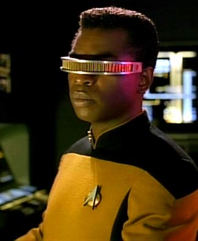

# Robots
## Bringing your code into the real world
By Chris Lofland

<small>You are not supposed to be able to read this. These are my notes. Consider it subtitles.</small>

# Why?
Because when you were a kid you thought you were going to grow up to be:

## Why?
Because building a robot is like building a video game, but in reverse.

Notes:
<small>We build the simulated environment inside of the computer based on the real world, using sensor data, and then attempt to navigate in that environment.
Our success is based both on how well we interact with the simulated environment and on how well our simulated environment mirrors the real world.
i.e. How does glass "appear" in our simulated environment?</small>

## Why?
Building robots is introspective,

Notes:
<small>As humans we do the same thing. While we interact with the real world all day long, our behavior and decisions are actually based on the simulated world we build in our heads. It is very easy for external and internal influences to altar that simulation and cause problems. i.e. Drunk driving . . . or just walking into very clean windows.

Humans have an amazing ability to cope with discrepancies in our simulation. When we see something that doesn't "make sense" we discard it, or at the very least weight our decisions based on our doubt.
We also have an amazing pattern, not so much recognition, but more like generation system. We can quickly find faces, moving objects, various threats (predators lurking in the grass so to speak), but we also find these in clouds, tree bark, etc.</small>

#Why Not?
The first limitation of robotics is input, and I break these down into two areas:

- Technology
- Cost

##Why Not?
Google Driverless car's Lidar

Notes:
The technology is arriving fast:
The self driving cars that Google "plays with" actually have a better idea of the world around them than you and I do.
While you and I rely on brake lights and a crude depth approximation system to know when the car in front of us is slowing down or stopping, the Google car knows the distance of the car in front of it down to the millimeter, and by proxy, the exact speed of that car at every microsecond.
The result is that in a following situation the Google car drives far more smoothly than a human can, because it can react sooner, and more gradually, to changes in the other car's velocity.
Unfortunately the 3D "Lidar" atop the Google car is about $75,000.

So if we could all get a hold of a handful of $75,000, or even $5,000 lidar units, home robots would be a lot easier.

#Willow Garage
<iframe width="560" height="315" src="https://www.youtube.com/embed/HMx1xW2E4Gg" frameborder="0" allowfullscreen></iframe>

Notes:
In 2006 Scott Hassan, an early Google employee who helped develop Google's technology, started a research lab and technology incubator devoted to developing hardware and open source software for personal robotics applications.
The goal was to create the tools necessary for people to advance the field of robotics without contiunually reinventing the wheel by building new hardware platforms and writing code to re-implement the same functions on every new platform.

#PR2 and ROS

Notes:
The hardware result of Willow Garage's work was PR2. PR2 is a relatively inexpensive fully functional robot
ready to buy "off the shelf" for research organizations such as Universities.

The software result was Robot Operating System (ROS).
ROS is not a program but a bundle containing hundreds of programs, utilizing almost as many drivers, all with a distributed architecture and a single API that can be interfaced with C++ or Python.

#PR2 and TurtleBot
The PR2 can navigate an office environment with amazing agility, it can plug itself in, it can play pool and even fetch you a beer!
PR2 costs $280,000.

ROS was designed around PR2, but it was also designed to work across any robot platform. PR2 was perhaps the cheapest "off the shelf" robot which could run ROS though.

The PR2 has two quad-core i7 Xeon processors on board, 24GB of RAM, 2 TB of disk space along with a couple of $5,000 lidar units.

##Kinect and a vacuum cleaner

What Willow Garage came up with was to use a $35 Microsoft Kinect sensor to simulate a very basic lidar, and a $200 vacuum cleaner for the robot itself!

After a couple of iterations, several vendors and two vacuum cleaner manufacturers, today you can buy a "TurtleBot 2" "off the shelf" for about $2,000 including the laptop computer to run ROS on.

You can put it together even cheaper if you source some of your own parts.

##Coding!
Most of the real work to be done in robotics is not hardware or implementation of the now well understood basic tasks.

It is in the coding.

What is really fun is to write the code to control the behavior,
because driving smoothly on the highway in a string of cars is really cool,
but what Google's car really wants to do is figure out how to merge into city traffic, and that is something a lot more complicated than just adjusting your speed based on a single input.

Besides, we want to code! Right?

#"ArloBot"
Why didn't I just buy a TurtleBot?

- I felt that the Turtlebot's payload and ground clearance severely limited its expandability.
- I wanted to play with the hardware myself

The key was to keep the same circular shape and "differential drive" so that I could just "plug in" the Turtlebot code.

##Robot Components
- Platforms: https://www.parallax.com/product/arlo-robotic-platform-system

Microcontrollers:

- Arduino: A lot of people use the Arduino to interface hardware with a ROS based system. There are some good ROS packages to make this easy.
- Parallax Propeller: https://www.parallax.com/microcontrollers/propeller

I chose this platform because of the Arlo Robotic platform. I had to write my own C code to run on the Propeller board to interface with ROS, but it is fun, and it is not very complicated.

##Robot Components
###Motors

- Must have encoders
- Must be mounted

###Sensors
- 'PING' Ultrasonic sensors are easiest, giving digital distance readings
- InfraRed sensors typically provide analog readings
    - They are highly susceptible to power line noise
    - They are highly susceptible to lighting interference, such as
        - Bright sunlight
        - Florescent lights
        - LED lights

##Robot Components
Computing platforms:

- Android: Complex implementation because of the platform. You cannot just cross-compile standard Linux tools, you have to build them. There are some ports of some bits of ROS to Android, but the results are not very exciting.

- Pi: Easier than Android because of access to the normal Linux command line and Linux tools. Raw CPU power is limited. ROS will not Pi without a lot of work.

- PC: If you want to run ROS, this is easy. Spend time making your robot do cool things instead of reinventing the wheel.

##Robot Components
#Wiring
This is the area I have the least documentation on.
In short, read up at learn.parallax.com and at SparkFun!
You will need to use breadboards, resistors and capacitors.
Honestly, it is easier to do than to explain.
If anyone wants to build one of these and document the wiring I would be excited to help!

##ROS
- Ubuntu: ROS runs on Ubuntu. That is the target. The difficulty with ROS is that it is really a collection of hundreds of packages, all with different maintainers, trying to adhear to common interface.
I think a big issue is the drivers. Things like the 3D sensors are not well supported and I find they break between versions of Ubuntu. Other drivers are the same. The latest version of ROS has a wider Ubuntu version target range than an previous release, so I have high hopes that they will eventually target "Linux".
Ultimately I try to stick with what is well supported, again, to avoid reinventing the wheel. I can spend an entire weekend trying to make it work where it is not supposed to, or I can just have fun making my robot do stuff.

##ROS
- Python and C++: ROS is a collection of programs. You write a program to do what you want to do. From the beginning they created the API to work with both C++ and Python. Many robotics engineers are actually very familiar with C++. It is also very efficient for some of the tasks that are processor intensive. However, they also wanted an easy entry for non-coders, so everything works with Python too. Ultimately the only reason to pick C++ is if you are a C++ guru, otherwise use Python.

##ROS
- Node.js: There is no direct interface to ROS for node.js, however there is a JavaScript interface. This interface works in browsers, but the port to node is still going through some growing pains. At this time it works with 0.10 versions of node, but not 0.11+ versions.
What I have been doing is a combination of creating scripts in Python that interface with my node scripts, and using the ROS Command Line tools, which are also very good.

#Demonstration:
- ROS nodes
- Launch files
- Topics
- Map
- RVIZ

## Getting started with ROS
Just get this book!

http://www.lulu.com/shop/r-patrick-goebel/ros-by-example-indigo-volume-1/ebook/product-22015937.html

# Resources
## Everything you've seen here can be found at:
- My GitHub Repo: [https://github.com/chrisl8/ArloBot](https://github.com/chrisl8/ArloBot)
- My Blog: [http://ekpyroticfrood.net/](http://ekpyroticfrood.net/)
- Robot Operating System: [http://www.ros.org/](http://www.ros.org/)
