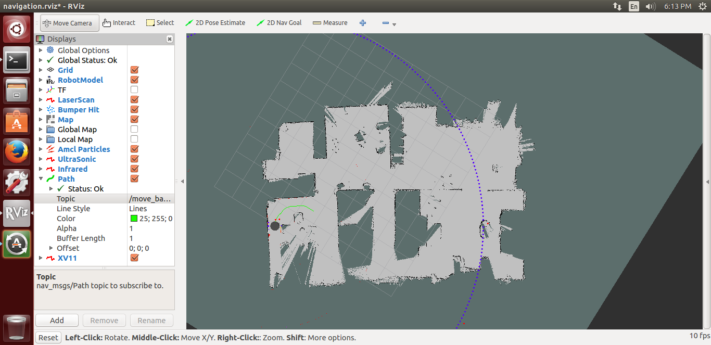
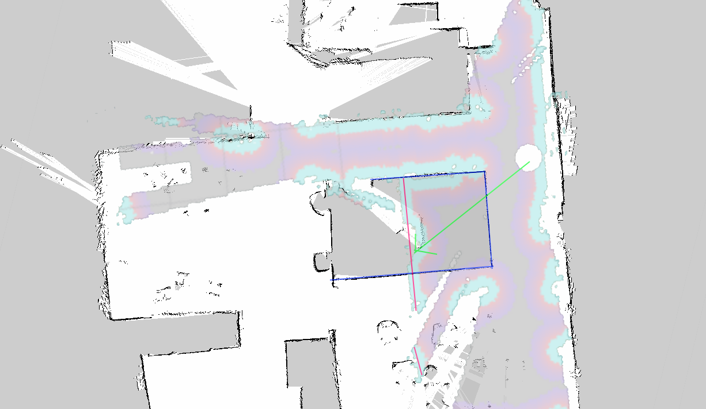
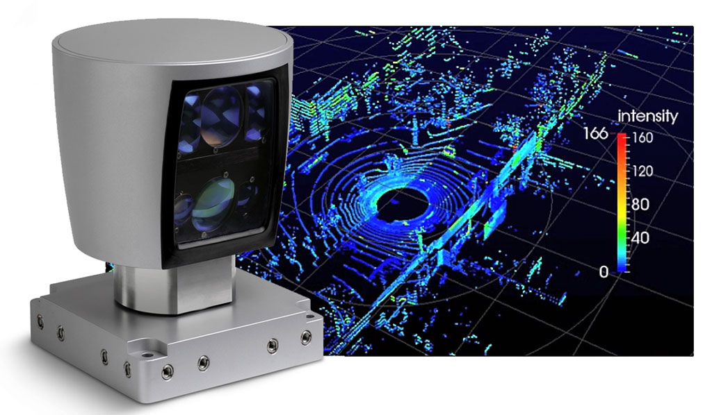
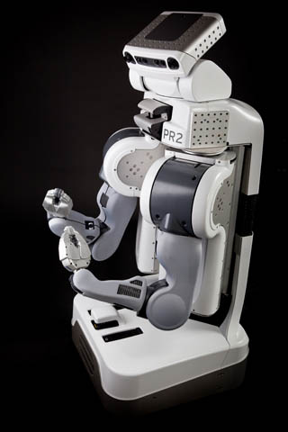
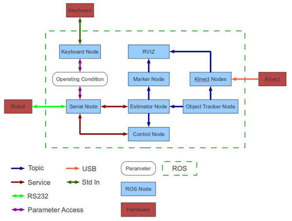
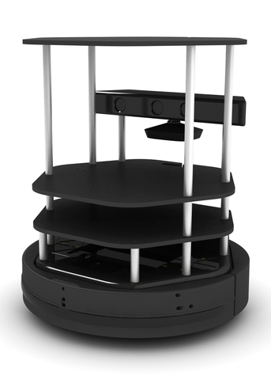
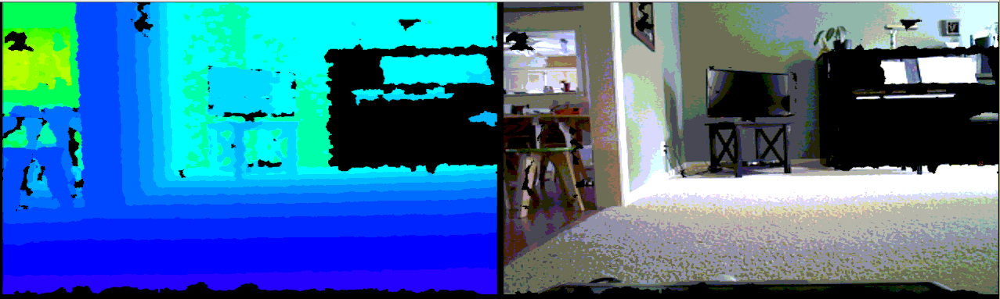
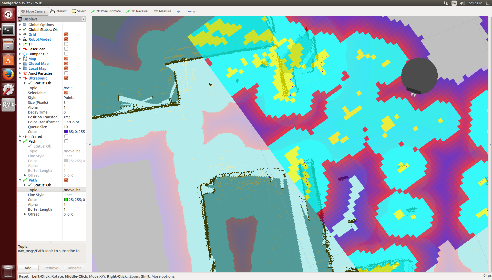
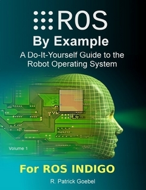

# Robots
## Bringing your code into the real world
By Chris Lofland

<small>Speaking notes are under (DOWN) each slide.</small>

# Setup:
- git push/pull latest https://plus.google.com/hangouts/active
- run python -m SimpleHTTPServer
- Open up the following links in new tabs:
    - https://www.youtube.com/embed/HMx1xW2E4Gg
    - https://www.youtube.com/embed/tBA87UGzrSk
    - https://www.parallax.com/product/arlo-robotic-platform-system
    - https://www.parallax.com/microcontrollers/propeller
    - https://plus.google.com/hangouts/onair
- Open up first picture in Pictures so I can scan through them
- Open up this file on my phone via Pocket get to read notes
- Get Arlobot up and running, make sure we can start Arlobot and Metatron.
- Test Arlobot:
    - VNC
    - SSH
    - Web Interface
    - RVIZ
- Start rqt_graph

# What Robots?

Anything that can physically interact with the analog world could be a kind of "robot".
I define a "robot" though as something that can gather information about the world,
make a decision without further human input, and take action.
This *could* include an automatic door though, but that is OK, because if you
think of an automatic door as a robot, it will inspire you to think about the
these simple objects with creativity.
The only thing I leave out of the "robot" category is purely remote control vehicles,
however often the first step, and also a useful function of, an autonomous vehicle is
a "telepresence" machine that allows you to monitor a remote environment
and interact with it.
Seth showed us how to use an Arduino and Node.js to code simple responses to sensor
input.

### Notes:
See Pictures.

I am going to focus on larger robots with autonomous navigation today.

I will talk about the tools and software I've found to build such a robot.

# My Goals

- A hobby.
    - Not a business or research project
- A mobile development platform on which to code, build and experiment.
    - Emphasis on code. :)

## Robots Everywhere
- http://www.newyorker.com/business/currency/lowes-robot-future-service-work
- http://www.westerndailypress.co.uk/Robots-help-deliver-meals-patients/story-22867113-detail/story.html
- http://www.bloomberg.com/video/inside-lego-s-robot-factory-where-toys-get-made-1vnaykmQTxSiuBWx4Skvgw.html
- http://www.businessinsider.com/amazon-robots-customer-orders-warehouses-2014-12
- http://www.dailymail.co.uk/sciencetech/article-2752400/Boris-dishwashing-robot-pick-crockery.html

## Notes:
See Pictures.

- This robot is going to be deployed to Home Depot and Lowe's stores to help customers find items using image recognition and the ability to navigate the store.
-  This robot navigates the halls of a hospital with trays of food and other supplies to free up nurses form spending their time pushing carts around. They operate "freely" in the halls, not on a track, but they are on a strict path. If something gets in the way they detect it, but the only stop, they do not navigate around obstacles.

## Notes:
See Pictures.

- This dish washing robot is able to analyze a physical item it has never encountered before and determine how to grasp and manipulate it
- LEGO also has a similar robotic system of delivery robots that shuttles bins of parts between the machines that make parts and machines that sort and package parts.
- Amazon also uses robots to life and move heavy items

## Why?
Because building a robot is like building a video game, but in reverse.

### Notes:
We build the simulated environment inside of the computer based on the real world, using sensor data, and then attempt to navigate in that environment.
Our success is based both on how well we interact with the simulated environment and on how well our simulated environment mirrors the real world.
i.e. How does glass "appear" in our simulated environment?

## Why?
Building robots is introspective,

### Notes:
As humans we do the same thing. While we interact with the real world all day long, our behavior and decisions are actually based on the simulated world we build in our heads. It is very easy for external and internal influences to altar that simulation and cause problems. i.e. Drunk driving . . . or just walking into very clean windows.

Humans have an amazing ability to cope with discrepancies in our simulation. When we see something that doesn't "make sense" we discard it, or at the very least weight our decisions based on our doubt.
We also have an amazing pattern, not so much recognition, but more like generation system. We can quickly find faces, moving objects, various threats (predators lurking in the grass so to speak), but we also find these in clouds, tree bark, etc.

# Why Not?
The first limitation of robotics is input, and I break these down into two areas:

- Technology
- Cost

## Why Not?
Google Driverless car's Lidar

### Notes:
The technology is arriving fast:
The self driving cars that Google "plays with" actually have a better idea of the world around them than you and I do.
While you and I rely on brake lights and a crude depth approximation system to know when the car in front of us is slowing down or stopping, the Google car knows the distance of the car in front of it down to the millimeter, and by proxy, the exact speed of that car at every microsecond.
The result is that in a following situation the Google car drives far more smoothly than a human can, because it can react sooner, and more gradually, to changes in the other car's velocity.
Unfortunately the 3D "Lidar" atop the Google car is about $75,000.

So if we could all get a hold of a handful of $75,000, or even $5,000 lidar units, home robots would be a lot easier.

#Willow Garage
https://www.youtube.com/embed/HMx1xW2E4Gg

###Notes:
In 2006 Scott Hassan, an early Google employee who helped develop Google's technology, started a research lab and technology incubator devoted to developing hardware and open source software for personal robotics applications.
The goal was to create the tools necessary for people to advance the field of robotics without continually reinventing the wheel by building new hardware platforms and writing code to re-implement the same functions on every new platform.

#PR2 and ROS

###Notes:
The hardware result of Willow Garage's work was PR2. PR2 is a relatively inexpensive fully functional robot
ready to buy "off the shelf" for research organizations such as Universities.

The software result was Robot Operating System (ROS).
ROS is not a program but a bundle containing hundreds of programs, utilizing almost as many drivers, all with a distributed architecture and a single API that can be interfaced with C++ or Python.

#PR2 and TurtleBot
The PR2 can navigate an office environment with amazing agility, it can plug itself in, it can play pool and even fetch you a beer!

**PR2 costs $280,000.**

ROS was designed around PR2, but it was also designed to work across any robot platform. PR2 was perhaps the cheapest "off the shelf" robot which could run ROS though.

The PR2 has two quad-core i7 Xeon processors on board, 24GB of RAM, 2 TB of disk space along with a couple of $5,000 lidar units.

##Kinect and a vacuum cleaner

- https://www.youtube.com/watch?v=tBA87UGzrSk

What Willow Garage came up with was to use a $35 Microsoft Kinect sensor to simulate a very basic lidar, and a $200 vacuum cleaner for the robot itself!

After a couple of iterations, several vendors and two vacuum cleaner manufacturers, today you can buy a "TurtleBot 2" "off the shelf" for about $2,000 including the laptop computer to run ROS on.

You can put it together even cheaper if you source some of your own parts.

##Kinect 3d Data

#Why ROS?
##SLAM!
###Simultaneous localization and mapping
Because if you robot does not know where it is, and how to get to where you want it to go, it is . . . lost.
###Words
- Odometry is the use of data from motion sensors to estimate change in position over time. Odometry is used by some robots, whether they be legged or wheeled, to estimate (not determine) their position relative to a starting location.
- Lidar a detection system that works on the principle of radar, but uses light from a laser.

###Notes:
When I first started building my Lego based robot, once I had "teleoperation" (remote control + camera) working,
I wanted to be able to send it from one room to another.
It turns out that this is a very difficult problem to solve. Lots of research has been put into it at universities
and government research facilities.
For the robot to go somewhere it first has to have some concept of it surroundings (the map), and be able to localize itself within that map in real time.
There are a lot of publications on SLAM, but very few implementations. Furthermore, they are computationally expensive.
ROS has two forms of SLAM built in! Hector, which uses a lidar without odometry and gmapping which uses the odometry also.
If you want to find a more simple method for a robot to localize itself in a pregenerated map look up Monte Carlo localization. It is well described in Wikipedia.

##Things that do not work
- 
Using a compass in a building.

- 
GPS for distances less than the length of your house.

###Simultaneous localization and mapping

Monte Carlo, Hector and Gmapping.

#ROS
The primary goal of ROS is to support code reuse in robotics research and development.
ROS is a distributed framework of processes (aka Nodes) that enables executables to be individually designed and loosely coupled at runtime. These processes can be grouped into Packages and Stacks, which can be easily shared and distributed. ROS also supports a federated system of code Repositories that enable collaboration to be distributed as well. This design, from the file system level to the community level, enables independent decisions about development and implementation, but all can be brought together with ROS infrastructure tools.

#ROS Pieces!

#Nodes
Nodes are processes that perform computation. For example, one node controls a laser range-finder, one node controls the wheel motors, one node performs localization, one node performs path planning, one Node provides a graphical view of the system, and so on. A ROS node is written with the use of a ROS client library, such as roscpp or rospy.

#Master
The ROS Master provides name registration and lookup so that all of the nodes can find each other, exchange messages, or invoke services.

#Parameter Server
The Parameter Server allows data (parameters) to be stored by key in a central location. It is currently part of the Master.

#Messages
Nodes communicate with each other by passing messages. A message is just a data structure, comprising typed fields.

#Topics
"Messages are routed via a transport system with publish / subscribe semantics. A node sends out a message by publishing it to a given topic. The topic is a name that is used to identify the content of the message. A node that is interested in a certain kind of data will subscribe to the appropriate topic. There may be multiple concurrent publishers and subscribers for a single topic, and a single node may publish and/or subscribe to multiple topics. In general, publishers and subscribers are not aware of each others' existence. The idea is to decouple the production of information from its consumption. Logically, one can think of a topic as a strongly typed message bus. Each bus has a name, and anyone can connect to the bus to send or receive messages as long as they are the right type."

#Services
The publish / subscribe model is a very flexible communication paradigm, but its many-to-many, one-way transport is not appropriate for request / reply interactions, which are often required in a distributed system. Request / reply is done via services, which are defined by a pair of message structures: one for the request and one for the reply. A providing node offers a service under a name and a client uses the service by sending the request message and awaiting the reply. ROS client libraries generally present this interaction to the programmer as if it were a remote procedure call.

#Bags
Bags are just a format for saving and playing back ROS message data. Bags are an important mechanism for storing data, such as sensor data, that can be difficult to collect but is necessary for developing and testing algorithms.

#"ArloBot"
## My implementation of ROS
Why didn't I just buy a TurtleBot?

- 
I felt that the Turtlebot's payload and ground clearance severely limited its expandability.

- 
I wanted to play with the hardware myself

The key was to keep the same circular shape and "differential drive" so that I could just "plug in" the Turtlebot code.

#Building your own Robot!
##Robot Components
- Platforms: https://www.parallax.com/product/arlo-robotic-platform-system

##Robot Components
Micro-controllers:

- Arduino: A lot of people use the Arduino to interface hardware with a ROS based system. There are some good ROS packages to make this easy.
- Parallax Propeller: https://www.parallax.com/microcontrollers/propeller

I chose this platform because of the Arlo Robotic platform. I had to write my own C code to run on the Propeller board to interface with ROS, but it is fun, and it is not very complicated.

##Robot Components
###Motors

- Must have encoders
- Must be mounted

###Sensors
- 'PING' Ultrasonic sensors are easiest, giving digital distance readings
- InfraRed sensors typically provide analog readings
    - They are highly susceptible to power line noise
    - They are highly susceptible to lighting interference, such as
        - Bright sunlight
        - Florescent lights
        - LED lights

##Robot Components
Computing platforms:

- Android: Complex implementation because of the platform. You cannot just cross-compile standard Linux tools, you have to build them. There are some ports of some bits of ROS to Android, but the results are not very exciting.

- Pi: Easier than Android because of access to the normal Linux command line and Linux tools. Raw CPU power is limited. ROS will not Pi without a lot of work.

- PC: If you want to run ROS, this is easy. Spend time making your robot do cool things instead of reinventing the wheel.

##Robot Components
#Wiring

- Every robot has a lot of wire!
- This is the area I have the least documentation on.
- In short, read up at learn.parallax.com and at SparkFun.
- You will need to use breadboards, resistors and capacitors.
- If anyone wants to build one of these and document the wiring I would be excited to help!
- Example: http://learn.parallax.com/KickStart/28015

(See Pictures)

#Ubuntu
ROS runs on Ubuntu. That is the target. The difficulty with ROS is that it is really a collection of hundreds of packages, all with different maintainers, trying to adhere to common interface.
I think a big issue is the drivers. Things like the 3D sensors are not well supported and I find they break between versions of Ubuntu. Other drivers are the same. The latest version of ROS has a wider Ubuntu version target range than an previous release, so I have high hopes that they will eventually target "Linux".
Ultimately I try to stick with what is well supported, again, to avoid reinventing the wheel. I can spend an entire weekend trying to make it work where it is not supposed to, or I can just have fun making my robot do stuff.

#Coding in ROS
##Python and C++

ROS is a collection of programs. You write a program to do what you want to do. From the beginning they created the API to work with both C++ and Python. Many robotics engineers are actually very familiar with C++. It is also very efficient for some of the tasks that are processor intensive. However, they also wanted an easy entry for non-coders, so everything works with Python too. Ultimately the only reason to pick C++ is if you are a C++ guru, otherwise use Python.

#ROS and Node.js
There is no direct interface to ROS for node.js, however there is a JavaScript interface. This interface works in browsers, but the port to node is still going through some growing pains. At this time it works with 0.10 versions of node, but not 0.11+ versions.
What I have been doing is a combination of creating scripts in Python that interface with my node scripts, and using the ROS Command Line tools, which are also very good.

#My Progress:

My initial goal was to run the map creation and map navigation functions of
the ROS TurtleBot packages on my robot. This is done.

Currently I am working on putting these functions into a web GUI:

- Startup
- Exploration
- Map loading
- Map location "tagging"
- Navigation to tagged locations

These are close to done.

#Demonstration:
- 
ROS nodes

- 
Launch files

- 
Topics

- 
Map

- 
RVIZ

# My Next Goals:

- Operate continuously in my house, going to preset locations based on
    - Other inputs, such as my alarm system
    - "Random" actions based on programmed "behaviors"
- Following me via some "tag" in or out of a mapped environment
- Generic human interaction based on sensor input and pre-generated content
- Face detection and tracking

# Dreams

- Extend mapping to 2D surface environments like sidewalks, similar to how a car
navigates on roads without walls
- Add arms
- Personalized interaction with individuals based on recognition and discovered information

## Getting started with ROS
Just get this book!

http://www.lulu.com/shop/r-patrick-goebel/ros-by-example-indigo-volume-1/ebook/product-22015937.html

# Resources
## Everything you've seen here can be found at:
- My GitHub Repo: [https://github.com/chrisl8/ArloBot](https://github.com/chrisl8/ArloBot)
- My Blog: [http://ekpyroticfrood.net/](http://ekpyroticfrood.net/)
- Robot Operating System: [http://www.ros.org/](http://www.ros.org/)
